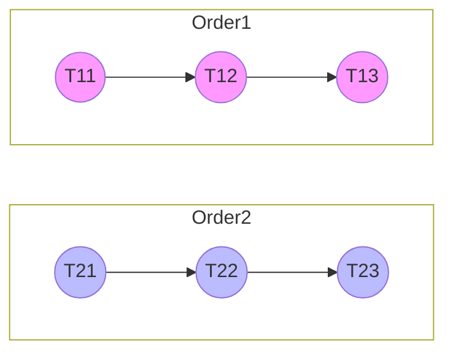
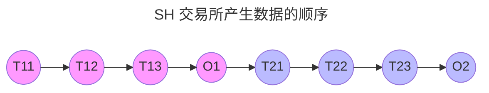
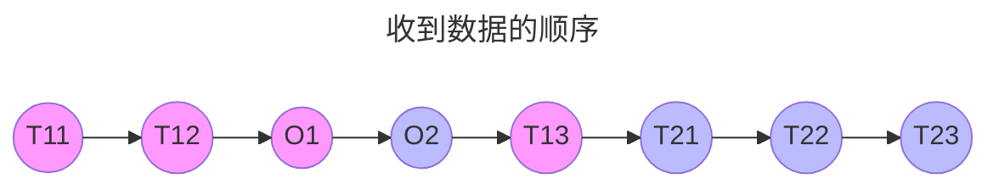
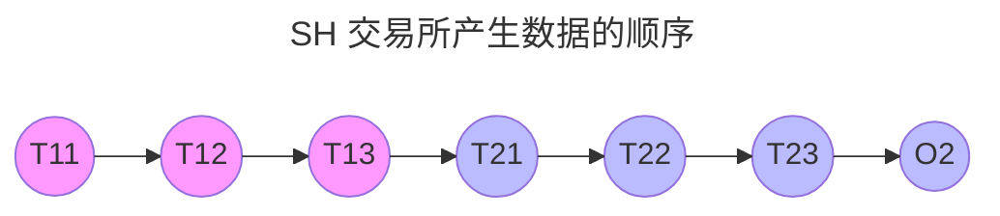
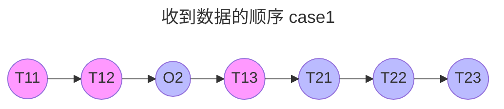
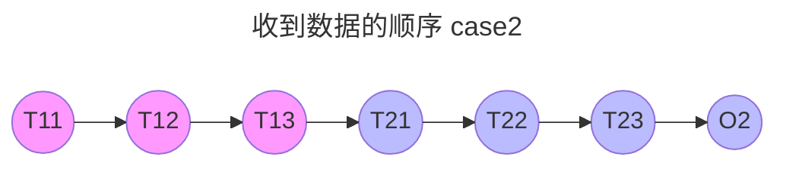

> 假定有 2 笔 Order, 每笔 Order 会产生 3 笔 Trade

## 例1

- 在这个序列里 [[biz_index]] 递增
- 同一笔订单的 [[trade|Trade]] 和 [[order|Order]] 是连续排布在一起, 所以 [[biz_index]] 也连续
---

- 我们假定收到的 [[trade|Trade]] / [[order|Order]] 流本身是有序的
- 这种情况下, 由于我们能收到 `O1`, 所以我们在收到 `T21` 时才能确定 `O1` 已经补充完全, 即可直接发送至下游
## 例 2

- 在这个序列里 [[biz_index]] 递增
- 同一笔订单的 [[trade|Trade]] 和 [[order|Order]] 是连续排布在一起, 所以 [[biz_index]] 也连续
- <mark style="background: #FFB8EBA6;">这个序列里 O1 并没被交易所生成, 意味着 O1 全部成交</mark>, 上交所不会产生 [[order|Order]] 数据, 所以只有 `O2` 的 3 笔 [[trade|Trade]] 
---

- 我们假定收到的 [[trade|Trade]] / [[order|Order]] 流本身是有序的
- 这种情况下, 我们必须收到 `O2` 及 `T21` 后, 才能确定 `O1` 已补充完全, 然后可发生至下游
    - `O2` 确认了 [[order|Order]] 流中已不存在 `O1`
    - `T21` 确认了 [[trade|Trade]] 流中已不存在 `O1` 相关的 [[Trade]] 数据

---

- 我们假定收到的 [[trade|Trade]] / [[order|Order]] 流本身是有序的
- 