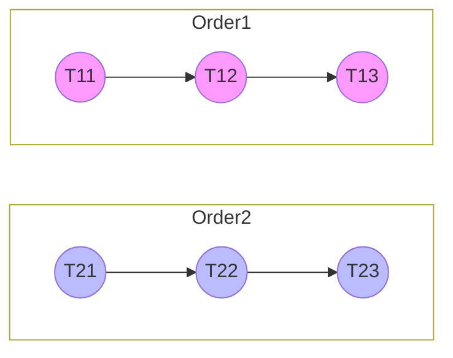
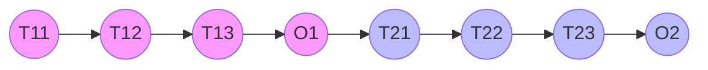

> 假定有 2 笔 Order, 每笔 Order 会产生 3 笔 Trade

```mermaid
flowchart TD

  T11@{ shape: circle}
  T12@{ shape: circle}
  T13@{ shape: circle}
  T21@{ shape: circle}
  T22@{ shape: circle}
  T23@{ shape: circle}

  subgraph Order1
    direction LR
    T11 --> T12 --> T13
  end

  subgraph Order2
    direction LR
    T21 --> T22 --> T23
  end

  Order1 ~~~ Order2
  
  style Order1 fill:None;
  style Order2 fill:None;
  classDef order1 fill:#f9f;
  classDef order2 fill:#bbf;
  class T11,T12,T13 order1;
  class T21,T22,T23 order2;
```
## 例1
SH 交易所产生数据的顺序

```mermaid
---
config:
  layout: elk
---
flowchart LR
  O1@{ shape: circle }
  T11@{ shape: circle }
  T12@{ shape: circle }
  T13@{ shape: circle }
  O2@{ shape: circle }
  T21@{ shape: circle }
  T22@{ shape: circle }
  T23@{ shape: circle }
  
  T11 --> T12 --> T13 --> O1
  O1 --> T21
  T21 --> T22 --> T23 --> O2
  
  classDef order1 fill:#f9f;
  classDef order2 fill:#bbf;
  class O1,T11,T12,T13 order1;
  class O2,T21,T22,T23 order2;
```
